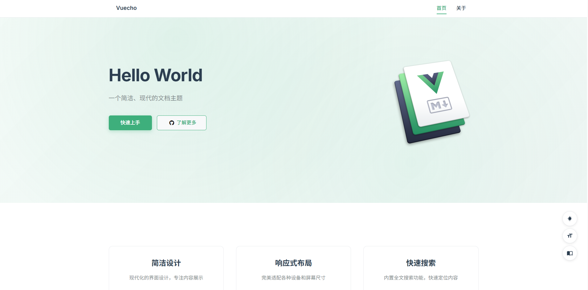

# VuePress风格Typecho文档主题



一个采用VuePress设计风格的Typecho文档主题，专为技术文档网站设计，提供清晰的导航结构和优秀的阅读体验。

[](https://opensource.org/licenses/MIT)
[](http://typecho.org/)
[](https://www.php.net/)

## 特性

- 🎨 **VuePress风格设计** - 采用简洁现代的设计风格，深蓝色主色调配绿色强调色
- 📱 **响应式布局** - 完美适配桌面、平板、手机等多种设备
- 🧭 **清晰导航结构** - 顶部导航栏、面包屑导航、侧边栏目录
- 📖 **自动目录生成** - 自动生成文章目录树，支持折叠展开
- 🔍 **全站搜索功能** - 实时搜索文档内容，支持关键词高亮

- 🏷️ **文档分类管理** - 支持分类和标签系统，便于内容组织
- ⚡ **性能优化** - 轻量级设计，快速加载

## 技术栈

- **后端**: PHP (Typecho 1.2+)
- **前端**: HTML5/CSS3/JavaScript (ES6+)

- **搜索功能**: Fuse.js
- **字体**: Inter (Google Fonts)

## 安装方法

### 环境要求

- **Typecho**: 1.2.0 或更高版本
- **PHP**: 7.4 或更高版本
- **Web服务器**: Apache/Nginx
- **浏览器**: 支持现代浏览器（Chrome 60+, Firefox 60+, Safari 12+, Edge 79+）
- **字体**: 注意给Typecho配置上伪静态并在后台开启地址重写功能 (必要)

### 方法一：Git克隆（推荐）

```bash
# 进入Typecho主题目录
cd /path/to/typecho/usr/themes/

# 克隆主题仓库
git clone https://github.com/matsuzaka-yuki/Vuecho.git

```

### 方法二：手动下载

1. 下载主题ZIP文件
2. 解压到 `usr/themes/` 目录下
3. 确保文件夹名称为 `Vuecho`
4. 设置适当的文件权限

### 方法三：FTP上传

1. 将主题文件夹上传到 `usr/themes/` 目录
2. 确保所有文件完整上传
3. 检查文件权限设置

### 启用主题

1. 登录Typecho后台管理界面
2. 导航至 `控制台` → `外观` → `设置外观`
3. 在可用主题列表中找到 `Vuecho`
4. 点击 `启用` 按钮
5. 主题启用成功后，访问网站前台查看效果

### 主题配置

启用主题后，进入 `控制台` → `外观` → `设置外观` → `设置` 进行详细配置：

#### 基础设置
- **站点Logo**: 上传或输入Logo图片地址
- **顶栏标题**: 自定义顶部导航栏显示的标题
- **首页Logo**: 首页Hero区域显示的Logo图片地址

#### 社交链接
- **GitHub地址**: 输入GitHub主页地址
- **联系邮箱**: 输入联系邮箱地址

#### 功能设置

- **搜索功能**: 开启/关闭全站搜索功能
- **评论功能**: 开启/关闭评论功能
- **Font Awesome图标**: 启用/禁用图标库

#### 首页设置
- **启用首页模式**: 开启后首页显示项目介绍，关闭则显示文章列表
- **项目标题**: 首页显示的项目标题
- **项目描述**: 首页显示的项目描述信息
- **快速上手**: 配置快速上手按钮的文字和链接
- **了解更多**: 配置了解更多按钮的文字、链接和图标
- **项目特性**: 配置项目特性列表

#### 高级设置
- **自定义CSS**: 添加自定义样式代码
- **自定义JavaScript**: 添加自定义脚本代码

## 快速开始

### 1. 创建第一篇文档

1. 登录Typecho后台
2. 点击 `撰写` → `撰写文章`
3. 输入文章标题和内容
4. 选择合适的分类
5. 发布文章

### 2. 配置导航菜单

在Typecho后台创建页面，主题会自动索引页面

### 3. 优化SEO设置

- 设置合适的站点标题和描述
- 为每篇文章添加摘要
- 使用合理的标题层级结构
- 添加适当的内链

### 4. 自定义样式

在主题设置的"自定义CSS"中添加你的样式：

```css
/* 自定义主色调 */
:root {
    --primary-color: #3eaf7c;
    --primary-dark: #369870;
}

/* 自定义字体 */
body {
    font-family: 'Your Custom Font', -apple-system, BlinkMacSystemFont, 'Segoe UI', Roboto, sans-serif;
}
```

## 目录结构

```
docs/
├── assets/                 # 静态资源目录
│   ├── css/
│   │   ├── style.css      # 主样式文件

│   ├── js/
│   │   ├── main.js        # 主要JavaScript功能

│   │   └── fuse.min.js    # 搜索功能库
│   └── images/            # 图片资源
├── index.php              # 首页模板
├── post.php               # 文章页模板
├── page.php               # 页面模板
├── archive.php            # 归档页模板
├── header.php             # 页面头部
├── footer.php             # 页面底部
├── sidebar.php            # 侧边栏
├── comments.php           # 评论模板
├── functions.php          # 主题函数
└── README.md              # 说明文档
```

## 使用指南

### 创建文档结构

1. **创建分类**: 在后台创建文档分类，如"快速开始"、"API文档"等
2. **发布文章**: 在对应分类下发布文档文章
3. **设置页面**: 创建"关于"、"联系"等独立页面
4. **配置分类和文章的图标**: 自行参考 [Font Awesome 使用说明](docs/FontAwesome.md)

### 文档编写建议

1. **使用标题层级**: 合理使用H1-H6标题，自动生成目录
2. **代码块语法**: 使用三个反引号包裹代码，指定语言类型
3. **图片优化**: 建议使用相对路径引用图片
4. **内链使用**: 多使用内部链接增强文档关联性


## 自定义配置

### 修改颜色主题

在主题设置的"自定义CSS"中添加：

```css
:root {
    --primary-color: #your-color;
    --primary-dark: #your-dark-color;
}
```

### 添加自定义功能

在主题设置的"自定义JavaScript"中添加：

```javascript
// 你的自定义JavaScript代码
```

## 常见问题

### Q: 主题安装后样式显示异常怎么办？

A: 请检查以下几点：
1. 确认主题文件完整上传
2. 检查文件权限设置
3. 清除浏览器缓存
4. 确认Typecho版本兼容性

### Q: 如何自定义主题颜色？

A: 在主题设置的"自定义CSS"中添加：
```css
:root {
    --primary-color: #your-color;
    --primary-dark: #your-dark-color;
}
```

### Q: 搜索功能不工作怎么办？

A: 请确认：
1. 主题设置中已开启搜索功能
2. JavaScript文件正常加载
3. 浏览器支持ES6语法

### Q: 如何添加自定义页面？

A: 
1. 在Typecho后台创建新页面
2. 选择合适的页面模板
3. 在导航设置中添加链接

### Q: 移动端显示有问题？

A: 主题采用响应式设计，如有问题请：
1. 检查viewport设置
2. 清除移动端浏览器缓存
3. 确认CSS文件完整加载

## 浏览器支持

- Chrome 60+
- Firefox 60+
- Safari 12+
- Edge 79+

## 更新日志

### v1.0.0 (2025-9-07)

- ✨ 添加Font Awesome图标支持
- 🎉 初始版本发布
- ✨ 实现VuePress风格设计
- ✨ 添加响应式布局支持

- ✨ 实现全站搜索功能
- ✨ 添加自动目录生成

## 贡献指南

我们欢迎所有形式的贡献！无论是报告bug、提出新功能建议，还是提交代码改进，都对项目的发展非常有帮助。

### 开发规范

#### 代码风格

- **PHP**: 遵循 PSR-12 编码标准
- **CSS**: 使用BEM命名规范
- **JavaScript**: 使用ES6+语法，遵循Airbnb风格指南

#### 提交信息格式

使用语义化提交信息：

```
type(scope): description

[optional body]

[optional footer]
```

类型说明：
- `feat`: 新功能
- `fix`: 修复bug
- `docs`: 文档更新
- `style`: 代码格式调整
- `refactor`: 代码重构
- `test`: 测试相关
- `chore`: 构建过程或辅助工具的变动

#### 分支命名

- `feature/功能名称`: 新功能开发
- `fix/问题描述`: bug修复
- `docs/文档类型`: 文档更新
- `style/样式描述`: 样式调整

## 许可证

本项目采用 MIT 许可证 - 查看 [LICENSE](LICENSE) 文件了解详情。

```
MIT License

Copyright (c) 2024 VuePress Docs Theme

Permission is hereby granted, free of charge, to any person obtaining a copy
of this software and associated documentation files...
```

## 致谢

- [Typecho](http://typecho.org/) - 优秀的博客平台
- [VuePress](https://vuepress.vuejs.org/) - 设计灵感来源

- [Fuse.js](https://fusejs.io/) - 模糊搜索库
- [Inter](https://rsms.me/inter/) - 优秀的字体

## 支持与反馈


### 社区交流

- 💬 **QQ群**: 1007524064

### 支持项目

如果这个主题对你有帮助，欢迎通过以下方式支持项目：

- ⭐ 给项目点个Star
- 🐛 报告bug和提出改进建议
- 💡 贡献代码和文档
- 📢 向朋友推荐这个主题

### 反馈渠道

我们重视每一个用户的反馈，请通过以下方式告诉我们你的想法：

- **功能建议**: 在Issues中使用`enhancement`标签
- **Bug报告**: 在Issues中使用`bug`标签
- **使用体验**: 发送邮件分享你的使用心得
- **案例展示**: 如果你使用了这个主题，欢迎分享你的网站